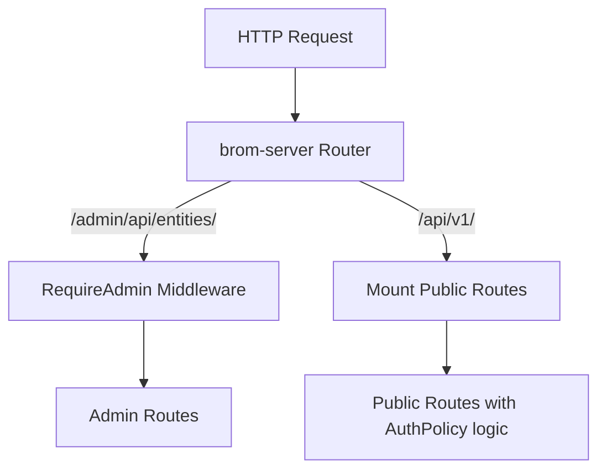

# Brom API Architecture Design

> **Applies to:** Phase 3B REST API & Codegen Implementation  
> **Role:** Source of Truth for API-related behavior  
> **Last updated:** 2026-04-07

## 1. Split API Surfaces
Brom generates two distinct REST API surfaces for every entity defined via `#[derive(BromEntity)]`. This enables strict separation of concerns between administrative curation and public consumption.

*   **Admin Surface (`/admin/api/`)**: Session-gated endpoints returning raw schema definitions and unfiltered entity data. Used exclusively by the embedded Leptos SPA dashboard.
*   **Public Surface (`/api/v1/`)**: Gated by the `AuthPolicy` configured on the entity. Strips hidden fields and enforces stricter validation. Used by frontend applications and third-party consumers.

---

## 2. Authentication Policy Matrix (`AuthPolicy`)

Each `BromEntity` defines its default exposure policy. This dictates how the `/api/v1/` routes for that entity behave.

| Policy | Read (`GET`) | Write (`POST`, `PUT`, `DELETE`) | Use Case (Public Surface) |
| :--- | :--- | :--- | :--- |
| `Public` | Open | API Key Required | Public blogs, read-heavy catalogs |
| `ApiKey` | API Key Required | API Key Required | Private APIs, gated content |
| `AdminOnly` | **404 Not Found** | **404 Not Found** | Internal lookup tables, audit logs |

> [!CAUTION]
> Regardless of the `AuthPolicy` setting, the Admin surface (`/admin/api/`) **always** requires a valid Admin Session for all endpoints.

---

## 3. Route Expansion & Router Assembly

The `#[derive(BromEntity)]` macro will generate **two separate axum routers** for each entity:

1.  `{entity_name}_admin_api::router()`: Exposes `GET`, `POST`, `PUT`, `DELETE` unprotected (relying on `brom-server` to mount them under the `RequireAdmin` middleware).
2.  `{entity_name}_api::router()`: Exposes the same methods but internally applies the `RequireApiKey` extractor based on the entity's `AuthPolicy`. For `AdminOnly`, this returns an empty router.

### Route Construction (brom-server)


---

## 4. API Endpoint Reference

### Admin Surface (`/admin/api/`)
*Authentication: Requires Valid Admin Session Cookie*

| Method | Endpoint | Description | Response Shape |
|:---:|:---|:---|:---|
| `GET` | `/schema` | Retrieve schema definitions for all content types | `[SchemaInfo]` |
| `GET` | `/entities/:collection` | Paginated listing of an entity | Raw Array of entities |
| `GET` | `/entities/:collection/:id` | Single entity lookup | Raw Entity |
| `POST` | `/entities/:collection` | Create new entity | Raw Entity |
| `PUT` | `/entities/:collection/:id` | Update entity | Raw Entity |
| `DELETE` | `/entities/:collection/:id` | Delete entity | 204 No Content |
| `GET` | `/keys` | List active Server API keys | Array of keys |
| `POST` | `/keys` | Generate a new API key | Return key hash |
| `DELETE` | `/keys/:id` | Revoke API key | 204 No Content |

### Public Surface (`/api/v1/`)
*Authentication: Follows Entity `AuthPolicy`*

| Method | Endpoint | Description | Response Shape |
|:---:|:---|:---|:---|
| `GET` | `/:collection` | Paginated public listing | `{ data: [...], meta: {...} }` |
| `GET` | `/:collection/:id` | Public entity lookup | `{ data: {...} }` |
| `POST` | `/:collection` | Create entity (API Key) | `{ data: {...} }` |
| `PUT` | `/:collection/:id` | Update entity (API Key) | `{ data: {...} }` |
| `DELETE` | `/:collection/:id` | Delete entity (API Key) | 204 No Content |

> [!IMPORTANT]
> The Public API responses **must** automatically strip any fields marked with `#[brom(hidden)]` at serialization time to prevent leaky abstractions.

---

## 5. API Key Management & Permission Model

API keys are required where an `AuthPolicy` stipulates. These are long-lived tokens configured inside the Admin Dashboard.
*   **Format**: Keys are generated securely with the pattern `brom_{prefix}_{random_suffix}`.
*   **Storage**: Only the cryptographically secure hash (SHA-256) and the prefix (first 8 chars) are stored in the database map against the `_brom_api_key` table.
*   **Permissions**: Keys support global scope flags (`read`, `write`, `delete`). Finer per-entity scoped API keys (e.g., token X can only read Posts but not Settings) are deferred to v2.

---

## 6. Public API Response Encoding

### Success Response (`GET`, `POST`, `PUT`)

To aid pagination and future-proof responses against backward compatibility issues, successful responses are packaged within a data wrapper structure.

```json
{
  "data": {
    "id": 1,
    "title": "Hello World",
    "created_at": "..."
    // Note: 'hidden' fields are stripped dynamically.
  },
  "meta": {
     // Currently only present dynamically for listing/pagination endpoints
  }
}
```

### Pagination & Filtering (v1 Target)
*   **Query Params**: 
    - `page` (default: 1)
    - `per_page` (default: 20, max: 100)
    - `sort` (e.g., `sort=-created_at`)
    - Exact match filters (e.g., `?status=published`)
*   **Response Envelope** (v1 Pagination Metadata):
```json
{
  "data": [ ... ],
  "meta": {
    "total_items": 120,
    "total_pages": 6,
    "current_page": 1,
    "per_page": 20
  }
}
```

### Standardized Error Responses
Any rejection should follow a generic problem-details shape compatible with RFC 7807 formats to allow robust error handling.

```json
{
  "error": "Short Error Identifier (e.g., ValidationFailed)",
  "message": "Human readable context describing the issue.",
  "fields": {
    "title": ["Cannot be empty"]
  }
}
```
*Note: `fields` may be omitted for generic errors like `Unauthorized` or `NotFound`.*
