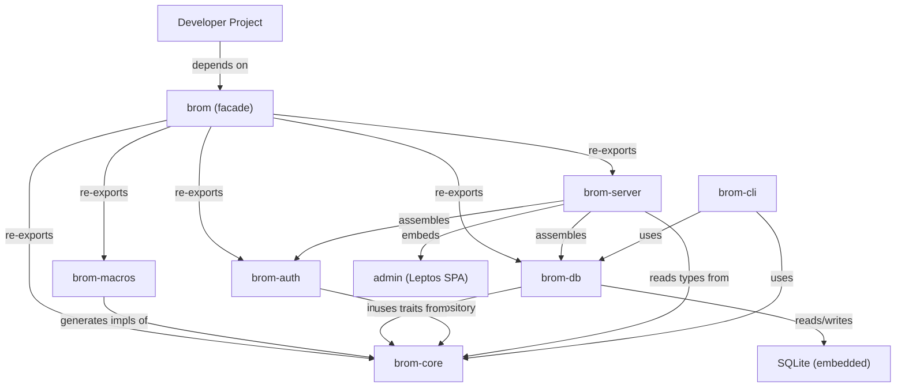
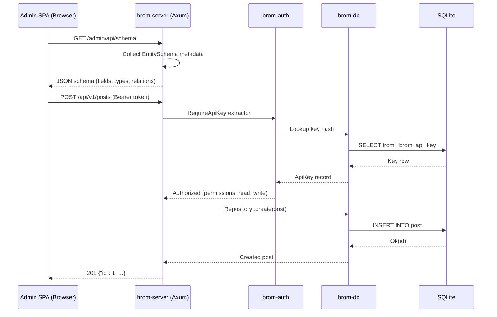
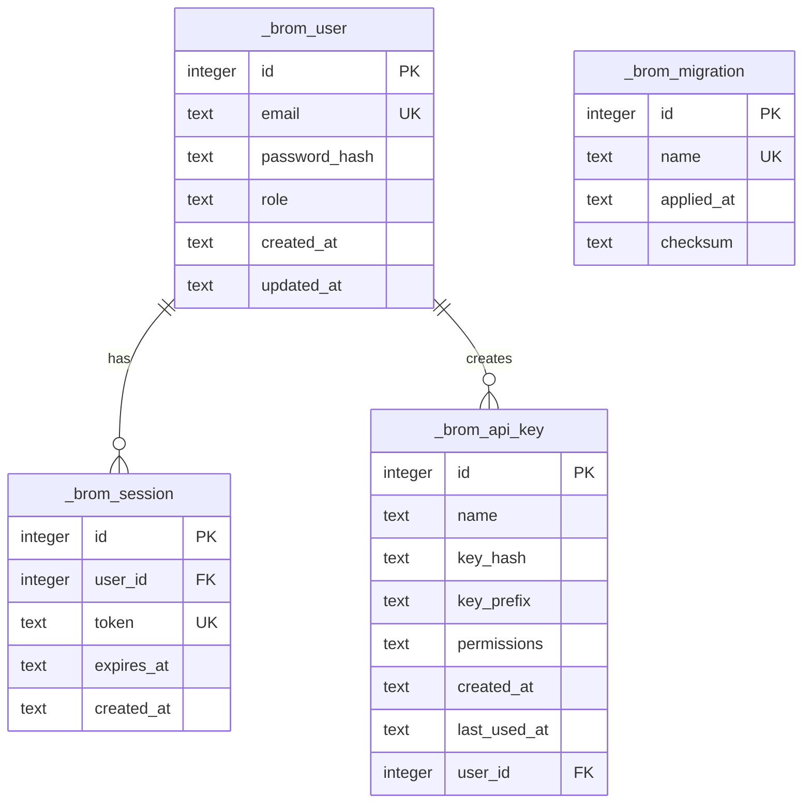

# Architecture — brom

## 1. Project Overview

**brom** is a code-first headless CMS framework for Rust. Developers define
content models as Rust structs with derive macros. The framework generates a
complete REST API, an embedded admin dashboard, and CLI migration tooling — all
compiled into a single, dependency-free binary suitable for distroless or static
container deployments.

The name references the architecture's philosophy: lightweight, fast, and
unembellished.

## 2. Project Objectives & Key Features

### Primary Objectives

- Deliver an ergonomic, macro-driven developer experience where a single
  `#[derive(BromEntity)]` annotation generates database schema, REST endpoints,
  OpenAPI documentation, and admin UI metadata.
- Ship as a single static binary with zero external runtime dependencies
  (SQLite compiled in, admin SPA embedded).
- Provide built-in authentication and authorization without requiring external
  identity providers.
- Support safe, reviewable database migrations via a companion CLI tool.
- Maintain sub-millisecond response latency for typical CMS read operations.

### Key Features

- **Code-First Schema**: Content types defined as Rust structs. The macro system
  generates all persistence, routing, and UI metadata at compile time.
- **Embedded Admin SPA**: A pre-compiled Leptos WASM application embedded into
  the binary via `rust-embed`. Dynamically renders forms from a `/admin/api/schema`
  endpoint — no per-project frontend compilation required.
- **REST API + OpenAPI**: Auto-generated CRUD endpoints with `utoipa` OpenAPI
  specs and embedded Swagger UI.
- **Relationship Types**: `Link<T>` for 1:N foreign keys, `ManyToMany<T>` for
  N:M with implicit join tables.
- **CLI Migration Tool**: `brom diff` compares struct definitions against the
  live database, generates timestamped `.sql` migration files for review.
  `brom migrate` applies pending migrations at startup or on demand.
- **Built-in Auth**: Admin session cookies (Argon2 + server-side sessions) and
  API keys (Bearer tokens with scoped permissions) ship out of the box.
- **Distroless Deployment**: Compiles to a fully static binary via
  `x86_64-unknown-linux-musl` with `rusqlite(bundled)`.

### Target Users / Audience

- Rust developers building content-driven applications (blogs, landing pages,
  documentation sites, internal tools) who want a lightweight, self-hosted CMS
  without the overhead of Node.js or Docker-Compose stacks.

### Non-Goals

- **Dynamic schema editing via the web UI** — content types are defined in code
  and compiled. This is not a no-code platform.
- **GraphQL API** — deferred to a future phase. REST + OpenAPI is the MVP API
  surface.
- **Multi-database support** — SQLite only. No Postgres/MySQL abstraction layer.
- **Multi-tenancy** — single-tenant by design. One binary = one CMS instance.
- **Server-Side Rendering** — the admin UI is a client-side SPA (CSR). No SSR
  or hydration complexity.

## 3. Language & Runtime

| Property              | Value                                              |
| --------------------- | -------------------------------------------------- |
| Language              | Rust                                               |
| Edition               | 2024                                               |
| Toolchain             | stable                                             |
| MSRV                  | 1.85.0 (Rust 2024 edition stabilization)           |
| Primary Target        | `x86_64-pc-windows-msvc` (dev), `x86_64-unknown-linux-musl` (release) |
| Secondary Target      | `wasm32-unknown-unknown` (admin SPA)               |
| Async Runtime         | Tokio (multi-threaded)                             |

## 4. Project Layout

```
brom/
├── Cargo.toml                  # Workspace manifest
├── architecture.md             # This document
├── context.md                  # Decision history (TARS)
├── spec.md                     # Behavioral contracts (TARS)
├── .agent/                     # TARS agent config
│   ├── workflows/              # Workflow definitions
│   ├── scripts/                # Automation scripts
│   └── rules/                  # Coding standards
│
├── crates/
│   ├── brom/                   # Facade crate — re-exports public API
│   │   └── src/lib.rs
│   │
│   ├── brom-core/              # Domain types, traits, schema representation
│   │   └── src/
│   │       ├── lib.rs
│   │       ├── entity.rs       # EntitySchema trait, field types
│   │       ├── schema.rs       # Runtime schema representation
│   │       ├── relation.rs     # Link<T>, ManyToMany<T> type wrappers
│   │       └── error.rs        # Core error types
│   │
│   ├── brom-macros/            # Proc-macro crate — #[derive(BromEntity)]
│   │   └── src/
│   │       ├── lib.rs
│   │       ├── entity.rs       # BromEntity derive expansion
│   │       ├── schema.rs       # Schema metadata generation
│   │       ├── routes.rs       # Axum handler generation
│   │       └── openapi.rs      # utoipa annotation generation
│   │
│   ├── brom-db/                # SQLite persistence layer
│   │   └── src/
│   │       ├── lib.rs
│   │       ├── pool.rs         # Connection pool (r2d2 + rusqlite)
│   │       ├── repository.rs   # Generic Repository<T> impl
│   │       ├── migration.rs    # Migration runner
│   │       ├── session.rs      # SqliteSessionStore impl
│   │       ├── api_key.rs      # SqliteApiKeyStore impl
│   │       └── error.rs        # DB error types
│   │
│   ├── brom-auth/              # Authentication & authorization
│   │   └── src/
│   │       ├── lib.rs
│   │       ├── password.rs     # Argon2 hashing & verification
│   │       ├── session.rs      # Session lifecycle (create/validate/expire)
│   │       ├── api_key.rs      # API key generation & validation
│   │       ├── rbac.rs         # Role-based access control logic
│   │       └── error.rs        # Auth error types
│   │
│   ├── brom-server/            # Axum web server integration
│   │   └── src/
│   │       ├── lib.rs
│   │       ├── router.rs       # Route assembly (admin, API, docs)
│   │       ├── middleware.rs    # Request logging, CORS, security headers
│   │       ├── extractor.rs    # Axum extractors (RequireAdmin, RequireApiKey)
│   │       ├── assets.rs       # rust-embed static file serving
│   │       ├── schema_api.rs   # GET /admin/api/schema endpoint
│   │       ├── openapi.rs      # Swagger UI mount
│   │       └── error.rs        # HTTP error mapping (IntoResponse)
│   │
│   └── brom-cli/               # Companion CLI tool
│       └── src/
│           ├── main.rs
│           ├── diff.rs         # Schema diffing (structs vs live DB)
│           ├── migrate.rs      # Apply pending migrations
│           ├── seed.rs         # Seed data loading
│           └── init.rs         # Project scaffolding
│
├── admin/                      # Leptos SPA (separate build target)
│   ├── Cargo.toml              # Leptos + TailwindCSS dependencies
│   ├── tailwind.config.js
│   ├── src/
│   │   ├── main.rs             # CSR entry point
│   │   ├── app.rs              # Root component + router
│   │   ├── pages/
│   │   │   ├── login.rs        # Login page
│   │   │   ├── dashboard.rs    # Overview dashboard
│   │   │   ├── collection.rs   # Entity list view
│   │   │   ├── editor.rs       # Entity create/edit form
│   │   │   └── settings.rs     # API keys, user management
│   │   └── components/
│   │       ├── field.rs        # Dynamic field renderer
│   │       ├── relation.rs     # Link<T> dropdown, ManyToMany<T> multi-select
│   │       ├── nav.rs          # Sidebar navigation
│   │       └── table.rs        # Data table with pagination
│   └── dist/                   # Build output (embedded by brom-server)
│
└── migrations/                 # Generated migration .sql files
    └── 00000000_000000_init.sql
```

## 5. Module Boundaries

### brom (facade)

- **Owns**: Public API surface. Re-exports from `brom-core`, `brom-macros`,
  `brom-server`, `brom-db`, `brom-auth`.
- **Does NOT own**: Any implementation logic.
- **Trait Interfaces**: None (pure re-export).
- **Mock Availability**: N/A.

### brom-core

- **Owns**: Domain types (`EntitySchema` trait, `FieldType` enum, `SchemaInfo`
  struct), relationship wrappers (`Link<T>`, `ManyToMany<T>`), validation rules.
- **Does NOT own**: Persistence, HTTP, authentication.
- **Trait Interfaces**:
  - `EntitySchema` — implemented by `#[derive(BromEntity)]` for each user struct.
  - `Repository<T: EntitySchema>` — generic CRUD interface for persistence.
- **Mock Availability**: `MockRepository<T>` via `mockall`.

### brom-macros

- **Owns**: Procedural macro expansion for `#[derive(BromEntity)]` and
  `#[brom(...)]` attributes. Code generation for schema metadata, Axum handlers,
  and `utoipa` annotations.
- **Does NOT own**: Runtime behavior. All output is generated Rust code.
- **Trait Interfaces**: Generates impls of `EntitySchema` from `brom-core`.
- **Mock Availability**: N/A (compile-time only). Tested via `trybuild`.

### brom-db

- **Owns**: SQLite connection pooling (`r2d2`), `SqliteRepository<T>`
  implementation, migration execution, session and API key storage.
- **Does NOT own**: Schema definition, authentication logic, HTTP.
- **Trait Interfaces**:
  - `SqliteRepository<T>` implements `Repository<T>` from `brom-core`.
  - `SqliteSessionStore` implements `SessionStore` from `brom-auth`.
  - `SqliteApiKeyStore` implements `ApiKeyStore` from `brom-auth`.
- **Mock Availability**: In-memory SQLite (`:memory:`) for integration tests.

### brom-auth

- **Owns**: Password hashing (Argon2), session lifecycle, API key
  generation/validation, RBAC logic.
- **Does NOT own**: Persistence (delegates to `SessionStore` / `ApiKeyStore`
  traits), HTTP routing.
- **Trait Interfaces**:
  - `SessionStore` — server-side session persistence.
  - `ApiKeyStore` — API key persistence and lookup.
- **Mock Availability**: `MockSessionStore`, `MockApiKeyStore` via `mockall`.

### brom-server

- **Owns**: Axum router assembly, middleware stack, Axum security extractors,
  `rust-embed` static asset serving, `/admin/api/schema` endpoint,
  Swagger UI mount, HTTP error mapping.
- **Does NOT own**: Business logic, persistence, authentication decisions.
- **Trait Interfaces**:
  - `AssetProvider` — abstraction for embedded static file serving.
- **Mock Availability**: `MockAssetProvider` (returns test HTML/WASM stubs).

### brom-cli

- **Owns**: CLI commands (`diff`, `migrate`, `seed`, `init`), schema comparison
  logic, migration file generation.
- **Does NOT own**: Runtime server, admin UI, authentication.
- **Trait Interfaces**: Uses `Repository<T>` from `brom-core` for DB access.
- **Mock Availability**: Temp directory + in-memory SQLite for integration tests.

### admin (Leptos SPA)

- **Owns**: The entire admin dashboard UI: login, dashboard, collection views,
  entity editor, settings. Dynamic form rendering from schema metadata.
- **Does NOT own**: Backend logic. Communicates exclusively via HTTP to the
  brom-server API.
- **Trait Interfaces**: None (standalone WASM binary).
- **Mock Availability**: N/A. Tested via browser integration tests.

## 6. Dependency Direction Rules

| Module       | May Import                              | Must NOT Import                    |
| ------------ | --------------------------------------- | ---------------------------------- |
| `brom`       | All crates (re-export only)             | —                                  |
| `brom-core`  | std, serde                              | Any `brom-*` crate                 |
| `brom-macros`| `brom-core` (types only), syn, quote    | `brom-db`, `brom-auth`, `brom-server` |
| `brom-db`    | `brom-core`, `brom-auth` (traits), rusqlite, r2d2 | `brom-server`, `brom-macros` |
| `brom-auth`  | `brom-core` (traits), argon2, rand      | `brom-db` (concrete), `brom-server` |
| `brom-server`| `brom-core`, `brom-db`, `brom-auth`, axum, utoipa | `brom-macros`, `brom-cli` |
| `brom-cli`   | `brom-core`, `brom-db`, clap            | `brom-auth`, `brom-server`         |
| `admin`      | leptos, reqwest/fetch                   | Any `brom-*` Rust crate            |

> **Rule**: `brom-db` implements persistence traits defined in `brom-auth`
> (`SessionStore`, `ApiKeyStore`) and `brom-core` (`Repository<T>`). `brom-auth`
> itself never depends on `brom-db` — concrete implementations are injected at
> the `brom-server` composition root.

## 7. Toolchain

| Tool       | Command                       | Purpose                          |
| ---------- | ----------------------------- | -------------------------------- |
| Formatter  | `cargo fmt --all`             | Code formatting (rustfmt)        |
| Linter     | `cargo clippy --workspace --all-targets` | Static analysis       |
| Tests      | `cargo test --workspace`      | Unit + integration tests         |
| Docs       | `cargo doc --workspace --no-deps` | API documentation           |
| AST Lint   | `sg scan`                     | Custom AST-grep rules            |
| Build      | `cargo build --release`       | Dev build (MSVC)                 |
| Release    | `cross build --release --target x86_64-unknown-linux-musl` | Static binary |
| Admin SPA  | `trunk build --release` (in `admin/`) | WASM compilation        |
| Migrations | `cargo run -p brom-cli -- diff` | Schema diff                    |
| Migrations | `cargo run -p brom-cli -- migrate` | Apply migrations            |
| Coverage   | `cargo llvm-cov`              | Code coverage (baseline)       |

### Verification Pipeline

```powershell
just verify
```

This recipe executes the complete 4-step pipeline (`fmt`, `clippy`, `test`, `sg scan`).
All commands must exit `0` before any commit.

## 8. Error Handling Strategy

| Crate        | Error Type            | Crate      | Pattern                                |
| ------------ | --------------------- | ---------- | -------------------------------------- |
| `brom-core`  | `brom_core::Error`    | `thiserror`| `SchemaError`, `ValidationError`, `RelationError` |
| `brom-db`    | `brom_db::Error`      | `thiserror`| `ConnectionError`, `QueryError`, `MigrationError`. Wraps `rusqlite::Error` via `From`. |
| `brom-auth`  | `brom_auth::Error`    | `thiserror`| `InvalidCredentials`, `SessionExpired`, `InsufficientPermissions`, `InvalidApiKey` |
| `brom-server`| `brom_server::Error`  | `thiserror`| Maps all sub-errors → HTTP status codes via `IntoResponse` |
| `brom-cli`   | `brom_cli::Error`     | `thiserror`| `DiffError`, `MigrateError`, `IoError` |
| `brom`       | `brom::Error`         | `thiserror`| Unified re-export wrapping all sub-errors |

**Propagation pattern**:
Each module defines its own error enum. Errors are mapped at module boundaries
via `From` impls. The `brom-server` layer is the terminal boundary where Rust
errors become HTTP responses.

**HTTP error mapping** (in `brom-server`):

| Rust Error                    | HTTP Status | Body                      |
| ----------------------------- | ----------- | ------------------------- |
| `ValidationError`             | 400         | `{"error": "...", "fields": {...}}` |
| `InvalidCredentials`          | 401         | `{"error": "Invalid credentials"}` |
| `SessionExpired`              | 401         | `{"error": "Session expired"}` |
| `InsufficientPermissions`     | 403         | `{"error": "Forbidden"}`  |
| `InvalidApiKey`               | 401         | `{"error": "Invalid API key"}` |
| `QueryError` (not found)      | 404         | `{"error": "Not found"}`  |
| `QueryError` (other)          | 500         | `{"error": "Internal server error"}` |

## 9. Observability & Logging

| Component   | Value                              |
| ----------- | ---------------------------------- |
| Framework   | `tracing` + `tracing-subscriber`   |
| Format      | Structured JSON (production), pretty-print (dev) |
| Config      | `BROM_LOG` env var (defaults to `info`) |

### Key Instrumented Spans

| Span               | Module         | Fields                           |
| ------------------- | ------------- | -------------------------------- |
| `http_request`      | `brom-server` | method, path, status, latency_ms |
| `db_query`          | `brom-db`     | table, operation, rows_affected  |
| `auth_check`        | `brom-auth`   | auth_type, user_id, result       |
| `migration_run`     | `brom-db`     | migration_name, direction        |
| `schema_resolve`    | `brom-server` | entity_count, field_count        |

## 10. Testing Strategy

| Crate         | Test Type     | Location           | Approach                        |
| ------------- | ------------- | ------------------ | ------------------------------- |
| `brom-core`   | Unit          | `src/` (inline)    | Pure logic, no IO               |
| `brom-macros` | Compile tests | `tests/`           | `trybuild` pass/fail cases      |
| `brom-db`     | Integration   | `tests/`           | In-memory SQLite (`:memory:`)   |
| `brom-auth`   | Unit          | `src/` (inline)    | Mocked `SessionStore`/`ApiKeyStore` |
| `brom-server` | Integration   | `tests/`           | `axum::test` request/response   |
| `brom-cli`    | Integration   | `tests/`           | Temp dirs + in-memory SQLite    |
| `admin`       | E2E           | TBD                | Browser testing (deferred)      |

### Coverage Expectations

- `brom-core`: ≥90% (pure logic, easy to test)
- `brom-db`: ≥80% (CRUD paths + migration edge cases)
- `brom-auth`: ≥85% (security-critical paths)
- `brom-server`: ≥70% (HTTP integration)
- `brom-macros`: Compile-test coverage of all attribute combinations

## 11. Documentation Conventions

- **Module docs**: Every `lib.rs` and public module must have a `//!` doc
  comment explaining purpose and usage.
- **Public items**: Every public function, struct, trait, and enum must have
  `///` doc comments with at least one example where applicable.
- **Internal items**: `// Reason:` comments for non-obvious logic.
- **Architecture sync**: `architecture.md` is the source of truth. Code must
  not contradict it. Use `/update-doc` workflow to sync after changes.

## 12. Dependencies & External Systems

### Key Crates

| Crate              | Purpose                        | Used By        |
| ------------------- | ------------------------------ | -------------- |
| `axum`             | HTTP framework                 | `brom-server`  |
| `tokio`            | Async runtime                  | `brom-server`  |
| `rusqlite`         | SQLite bindings (bundled)      | `brom-db`      |
| `r2d2`             | Connection pooling             | `brom-db`      |
| `serde` / `serde_json` | Serialization              | All crates     |
| `thiserror`        | Error derive macros            | All crates     |
| `tracing`          | Structured logging             | All crates     |
| `utoipa`           | OpenAPI spec generation        | `brom-server`, `brom-macros` |
| `utoipa-swagger-ui`| Embedded Swagger UI            | `brom-server`  |
| `rust-embed`       | Static asset embedding         | `brom-server`  |
| `argon2`           | Password hashing               | `brom-auth`    |
| `rand`             | API key generation             | `brom-auth`    |
| `syn` / `quote`    | Proc-macro parsing             | `brom-macros`  |
| `clap`             | CLI argument parsing           | `brom-cli`     |
| `leptos`           | Reactive UI framework (CSR)    | `admin`        |
| `trunk`            | WASM build tool                | `admin`        |

### External Systems

| System       | Protocol | Purpose                                      |
| ------------ | -------- | -------------------------------------------- |
| SQLite       | Embedded | Primary data store (compiled into binary)    |
| Filesystem   | Local    | Migration files, SQLite database file        |

> No external network services are required at runtime.

## 13. Architecture Diagrams

### Module Interaction



### Data Flow



### Entity-Relationship Diagram (Internal Tables)



## 14. Known Constraints & Technical Debt

| Constraint                     | Impact                                 | Mitigation                       |
| ------------------------------ | -------------------------------------- | -------------------------------- |
| SQLite single-writer lock      | Write contention under high concurrency | WAL mode + connection pooling   |
| WASM binary size               | Admin SPA may be 2–5 MB compressed     | `wasm-opt`, code-splitting (future) |
| Proc-macro compile times       | Increased build times for user projects | Minimize generated code, cache  |
| No hot-reload for admin SPA    | Dev cycle requires full rebuild        | `trunk serve --watch` for admin dev |
| `ALTER TABLE` limitations in SQLite | Cannot drop or rename columns natively | Migration tool generates workarounds (recreate table pattern) |
| Cross-compilation complexity   | musl + bundled SQLite requires `cross` | Document in README, provide Dockerfile |

## 15. Data Model

### Internal Tables

All internal tables use the `_brom_` prefix to avoid collision with
user-defined entities.

#### `_brom_user`

| Column          | Type    | Constraints               | Notes                  |
| --------------- | ------- | ------------------------- | ---------------------- |
| `id`            | INTEGER | PK AUTOINCREMENT          | —                      |
| `email`         | TEXT    | NOT NULL, UNIQUE          | Login identifier       |
| `password_hash` | TEXT    | NOT NULL                  | Argon2id hash          |
| `role`          | TEXT    | NOT NULL, DEFAULT 'admin' | superadmin, admin, editor |
| `created_at`    | TEXT    | NOT NULL                  | ISO 8601               |
| `updated_at`    | TEXT    | NOT NULL                  | ISO 8601               |

#### `_brom_session`

| Column       | Type    | Constraints                            | Notes          |
| ------------ | ------- | -------------------------------------- | -------------- |
| `id`         | INTEGER | PK AUTOINCREMENT                       | —              |
| `user_id`    | INTEGER | NOT NULL, FK → `_brom_user(id)` ON DELETE CASCADE | — |
| `token`      | TEXT    | NOT NULL, UNIQUE                       | Session token  |
| `expires_at` | TEXT    | NOT NULL                               | ISO 8601       |
| `created_at` | TEXT    | NOT NULL                               | ISO 8601       |

#### `_brom_api_key`

| Column        | Type    | Constraints                            | Notes              |
| ------------- | ------- | -------------------------------------- | ------------------ |
| `id`          | INTEGER | PK AUTOINCREMENT                       | —                  |
| `name`        | TEXT    | NOT NULL                               | Human label        |
| `key_hash`    | TEXT    | NOT NULL                               | SHA-256 of raw key |
| `key_prefix`  | TEXT    | NOT NULL                               | First 8 chars      |
| `permissions` | TEXT    | NOT NULL, DEFAULT 'read'               | read, read_write   |
| `created_at`  | TEXT    | NOT NULL                               | ISO 8601           |
| `last_used_at`| TEXT    |                                        | Nullable           |
| `user_id`     | INTEGER | NOT NULL, FK → `_brom_user(id)`        | Creator            |

#### `_brom_migration`

| Column       | Type    | Constraints          | Notes                    |
| ------------ | ------- | -------------------- | ------------------------ |
| `id`         | INTEGER | PK AUTOINCREMENT     | —                        |
| `name`       | TEXT    | NOT NULL, UNIQUE     | Timestamped filename     |
| `applied_at` | TEXT    | NOT NULL             | ISO 8601                 |
| `checksum`   | TEXT    | NOT NULL             | SHA-256 of .sql content  |

### User-Defined Entity Conventions

Every struct annotated with `#[derive(BromEntity)]` automatically receives:

| Column       | Type    | Constraints                    | Notes              |
| ------------ | ------- | ------------------------------ | ------------------ |
| `id`         | INTEGER | PK AUTOINCREMENT               | Auto-generated     |
| `created_at` | TEXT    | NOT NULL, DEFAULT CURRENT_TIMESTAMP | Auto-managed    |
| `updated_at` | TEXT    | NOT NULL, DEFAULT CURRENT_TIMESTAMP | Auto-managed    |

### Relationship Conventions

- **`Link<T>`**: Generates `{target}_id INTEGER NOT NULL REFERENCES {target}(id)`.
  Cascade rule configurable via `#[brom(on_delete = "cascade")]`.
- **`ManyToMany<T>`**: Generates junction table `{entity_a}_{entity_b}`
  (alphabetical) with composite PK and CASCADE deletes on both FKs.

### Migration Strategy

| Property        | Value                                              |
| --------------- | -------------------------------------------------- |
| Tool            | `brom-cli` (`diff` + `migrate` subcommands)        |
| Naming          | `YYYYMMDD_HHMMSS_description.sql`                  |
| Rollback        | Each `.sql` has `-- UP` and `-- DOWN` sections      |
| State tracking  | `_brom_migration` table with checksum verification  |
| Location        | `migrations/` directory in project root             |

### Naming Conventions

- `snake_case` for all tables and columns.
- Singular table names (`post`, not `posts`).
- FK columns: `{referenced_table}_id`.
- Junction tables: `{table_a}_{table_b}` (alphabetical).
- Internal tables: `_brom_` prefix.
