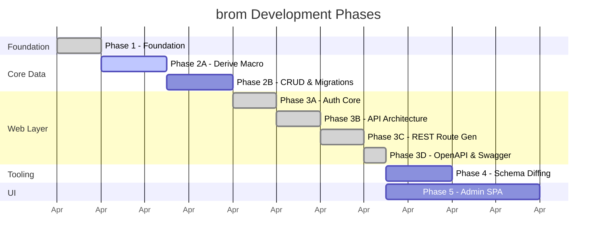
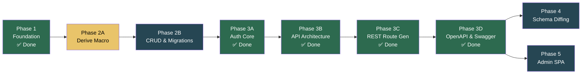

# Roadmap — brom

| Field         | Value                    |
|---------------|--------------------------|
| **Project**   | brom                     |
| **Version**   | 1.0.0                    |
| **Created**   | 2026-04-02               |
| **Updated**   | 2026-04-02               |

> This document is the **phasing source of truth** for the brom project. It
> defines what ships in each phase, the dependency chain between phases, and
> the design decisions that shaped the roadmap. All implementation plans must
> reference a phase defined here.

---

## Design Decisions

These decisions were made during brainstorming and shape the entire roadmap.

| Decision | Choice | Rationale |
|----------|--------|-----------|
| **Auth timing** | Auth-Early | REST API endpoints are never shipped without access control. Auth is implemented *before* route generation, not after. |
| **Handler inclusion** | With Auth | Axum handler generation in the macro requires auth extractors to exist first. Routes and auth ship together in Phase 3. |
| **Schema diffing** | Own phase | `brom diff` is complex enough (live DB introspection + struct metadata comparison + SQL generation) to warrant focused planning. |
| **Admin SPA** | Own phase | Leptos WASM is a different tech stack (CSR, Trunk, TailwindCSS). Isolated to avoid cross-compilation friction. |
| **Phase 2 split** | Macro vs Runtime | The derive macro (compile-time) and the repository CRUD (runtime) are different domains with different test strategies. Splitting keeps each phase at M-tier (~8–10 steps). |
| **Serde intermediary** | `serde_json::Value` | brom-core must not depend on rusqlite. Serde provides a portable bridge between domain types and SQLite at the cost of a small serialization overhead acceptable for CMS workloads. |

---

## Phase Overview



| Phase | Name | Focus | Tier | Status | Crates Touched |
|-------|------|-------|------|--------|----------------|
| 1 | Foundation | Workspace, traits, pooling | M | ✅ Done | all (scaffold) |
| 2A | Derive Macro | Compile-time codegen | M | 🔜 Next | `brom-core`, `brom-macros` |
| 2B | CRUD & Migrations | Runtime persistence | M | ⏳ Blocked by 2A | `brom-db`, `brom-cli` |
| 3A | Auth Core | Password, Sessions, RBAC | M | ✅ Done | `brom-auth`, `brom-db` |
| 3B | API Architecture | Middleware, Extractor, Server | M | ✅ Done | `brom-auth`, `brom-server` |
| 3C | REST Route Gen | BromEntity handler codegen | M | ✅ Done | `brom-macros` |
| 3D | OpenAPI & Swagger | Utoipa integration | S | ✅ Done | `brom-server`, `brom-macros` |
| 4 | Schema Diffing | `brom diff` engine | M | ⏳ Blocked by 3D | `brom-cli`, `brom-db` |
| 5 | Admin SPA | Leptos embedded UI | L | ⏳ Blocked by 3D | `admin`, `brom-server` |

---

## Dependency Graph



> **Note:** Phases 4 and 5 are independent of each other — both depend only on
> Phase 3D. They can be developed in parallel or in either order.

---

## Phase 1: Foundation ✅

> **Status:** Complete · **Commit:** `3855be8`

### Scope

Scaffold the virtual workspace with 8 crates. Implement domain types, SQLite
connection pooling, and stub all module boundaries with frozen trait interfaces.

### Deliverables

- [x] Workspace `Cargo.toml` with unified linting and shared dependencies
- [x] `brom-core`: `EntitySchema` trait, `FieldType`, `FieldInfo`, `SchemaInfo`,
  `Constraint`, `AuthPolicy`, `Repository<T>` trait, `Link<T>`, `ManyToMany<T>`,
  `SchemaRegistry`, `Pagination`, core `Error` enum
- [x] `brom-db`: `DbPool` (r2d2 + rusqlite bundled), `MigrationRunner` with
  `ensure_internal_tables()`, `SqliteRepository<T>` stub, `DbError` enum
- [x] `brom-auth`: `SessionStore` / `ApiKeyStore` trait stubs, `evaluate_policy` stub
- [x] `brom-server`: Error → HTTP mapping (`IntoResponse`)
- [x] `brom-cli`: Clap skeleton with `migrate` and `new` subcommand stubs
- [x] `brom`: Facade crate re-exporting public API
- [x] `.editorconfig`, `.gitignore`, `.gitattributes`
- [x] Verification pipeline: `cargo fmt` + `cargo clippy` + `cargo test` + `sg scan`

### Exit Criteria

All verification pipeline commands exit `0`. All stubs compile and are
documented with `STUB(Phase N)` markers.

---

## Phase 2A: Derive Macro

> **Status:** Next · **Depends on:** Phase 1
> **Crates:** `brom-core` (minor modification), `brom-macros` (primary)

### Objective

Implement the `#[derive(BromEntity)]` procedural macro so that annotating a
Rust struct generates a complete `impl EntitySchema` with table name, field
metadata, constraints, UI hints, and auth policy — all at compile time.

### Scope

| In Scope | Out of Scope |
|----------|-------------|
| Struct field parsing → `FieldType` inference | `Link<T>` / `ManyToMany<T>` relationship awareness |
| `#[brom(table_name)]` override | `Option<T>` nullable field handling |
| `#[brom(auth)]` policy | Axum handler generation (`routes.rs`) |
| `#[brom(unique)]`, `#[brom(default)]` constraints | OpenAPI annotation generation (`openapi.rs`) |
| `#[brom(ui(widget, hidden))]` | Runtime behavior of any kind |
| `trybuild` compile tests | Integration with `SqliteRepository` |
| brom-core `Error` refinement (`#[non_exhaustive]`, `Database` variant) | — |

### Stubs Consumed

| Stub | Location | Action |
|------|----------|--------|
| `BromEntity` derive (no-op `TokenStream::new()`) | `brom-macros/src/lib.rs` | Replace with full expansion |

### Stubs Created

| Stub | Location | Scheduled |
|------|----------|-----------|
| `routes.rs` (Axum handler generation) | `brom-macros/src/routes.rs` | Phase 3B |
| `openapi.rs` (utoipa annotation generation) | `brom-macros/src/openapi.rs` | Phase 3B |

### New Files

| File | Purpose |
|------|---------|
| `brom-macros/src/entity.rs` | `expand_brom_entity()` — derive expansion logic |
| `brom-macros/src/schema.rs` | Attribute parsing, field type inference, name conversion |
| `brom-macros/tests/derive_test.rs` | `trybuild::TestCases` runner |
| `brom-macros/tests/fixtures/basic_entity.rs` | Pass test: String, i64, bool fields |
| `brom-macros/tests/fixtures/custom_table.rs` | Pass test: `#[brom(table_name = "...")]` |
| `brom-macros/tests/fixtures/with_auth.rs` | Pass test: `#[brom(auth = "api_key")]` |

### Type Mapping

| Rust Type | `FieldType` Variant | SQLite Affinity |
|-----------|--------------------|--------------------|
| `String` | `FieldType::String` | `TEXT NOT NULL` |
| `i64` / `i32` | `FieldType::Integer` | `INTEGER NOT NULL` |
| `f64` / `f32` | `FieldType::Float` | `REAL NOT NULL` |
| `bool` | `FieldType::Boolean` | `INTEGER NOT NULL` (0/1) |

### Attribute Reference

| Attribute | Level | Effect |
|-----------|-------|--------|
| `#[brom(table_name = "custom")]` | Struct | Overrides default `snake_case` table name |
| `#[brom(auth = "public")]` | Struct | `AuthPolicy::Public` (default) |
| `#[brom(auth = "api_key")]` | Struct | `AuthPolicy::ApiKey` |
| `#[brom(auth = "admin_only")]` | Struct | `AuthPolicy::AdminOnly` |
| `#[brom(unique)]` | Field | Adds `Constraint::Unique` |
| `#[brom(default = "value")]` | Field | Adds `Constraint::Default("value")` |
| `#[brom(ui(widget = "markdown"))]` | Field | Sets `ui_widget = Some("markdown")` |
| `#[brom(ui(hidden))]` | Field | Sets `hidden = true` |

### Exit Criteria

- `cargo test -p brom-macros` passes (trybuild fixtures).
- `cargo clippy --workspace --all-targets -- -D warnings` exit 0.
- `cargo fmt --all --check` exit 0.
- All generated `impl EntitySchema` methods return correct metadata.

---

## Phase 2B: CRUD & Migrations

> **Status:** Blocked by 2A · **Depends on:** Phase 2A
> **Crates:** `brom-db` (primary), `brom-cli` (wiring)

### Objective

Implement the `SqliteRepository<T>` CRUD operations using the `EntitySchema`
metadata generated by the Phase 2A macro, and complete the file-based
migration runner.

### Scope

| In Scope | Out of Scope |
|----------|-------------|
| `SqliteRepository<T>` holds `DbPool`, performs real SQL | Relationship-aware queries (`JOIN` for `Link<T>`) |
| `create()` → `INSERT`, returns auto-generated `id` | `brom diff` (schema comparison) |
| `find_by_id()` → `SELECT WHERE id = ?` | `brom seed` / `brom init` |
| `find_all()` → paginated `SELECT` | HTTP/Axum integration |
| `update()` / `delete()` / `count()` | Auth-protected operations |
| `MigrationRunner::run_pending()` reads `.sql` files | Migration rollback (`-- DOWN` parsing) |
| SHA-256 checksum verification for migrations | — |
| CLI `migrate` command wiring | — |
| `Repository<T>` gains `Serialize + DeserializeOwned` bounds on `T` | — |
| Integration tests with derived entities from Phase 2A | — |

### Stubs Consumed

| Stub | Location | Action |
|------|----------|--------|
| `SqliteRepository<T>` CRUD (returns stub errors) | `brom-db/src/repository.rs` | Replace with real SQL |
| `MigrationRunner::run_pending()` (returns empty vec) | `brom-db/src/migration.rs` | Implement file-based application |
| CLI `migrate` (prints stub message) | `brom-cli/src/main.rs` | Wire to `MigrationRunner` |

### Stubs Created

| Stub | Location | Scheduled |
|------|----------|-----------|
| CLI `diff` command | `brom-cli/src/main.rs` | Phase 4 |
| Migration rollback support | `brom-db/src/migration.rs` | Phase 4 |

### Interface Changes

**`Repository<T>` trait** — adds serde bounds:
```rust
pub trait Repository<T>: Send + Sync
where
    T: EntitySchema + Serialize + for<'de> Deserialize<'de>,
```

**`SqliteRepository<T>`** — new constructor requiring `DbPool`:
```rust
pub struct SqliteRepository<T> {
    pool: DbPool,
    _marker: PhantomData<T>,
}
impl<T> SqliteRepository<T> {
    pub fn new(pool: DbPool) -> Self;
}
```

**`brom_core::Error`** — adds variants:
```rust
#[non_exhaustive]
pub enum Error {
    // ... existing variants ...
    Database(String),
    Serde(String),
}
```

**`brom_db::DbError`** — adds variant:
```rust
#[non_exhaustive]
pub enum DbError {
    // ... existing variants ...
    IoError(String),
}
```

### Auto-Managed Columns

Per `architecture.md` §15, every entity table includes:

| Column | Type | Managed By |
|--------|------|------------|
| `id` | `INTEGER PK AUTOINCREMENT` | SQLite (on INSERT) |
| `created_at` | `TEXT NOT NULL` | Repository (on create) |
| `updated_at` | `TEXT NOT NULL` | Repository (on create + update) |

These columns are **not** part of the user's struct definition. The repository
adds them automatically during SQL generation.

### New Dependencies

| Crate | Version | Purpose | Added To |
|-------|---------|---------|----------|
| `sha2` | `0.10` | Migration file checksums | `brom-db` |

### Exit Criteria

- `cargo test --workspace` passes (including CRUD integration + migration tests).
- Full verification pipeline exit 0.
- CLI `cargo run -p brom-cli -- migrate` applies `.sql` files from `migrations/`.

---

## Phase 3A: Auth Core ✅

> **Status:** Complete · **Depends on:** Phase 2B
> **Crates:** `brom-auth` (primary), `brom-db` (extension)

### Objective

Implement the core authentication and authorization logic, including password hashing, session lifecycle, API key management, and RBAC evaluations.

### Scope

| In Scope | Out of Scope |
|----------|-------------|
| `brom-auth`: Argon2 password hashing + verification | REST API endpoints |
| `brom-auth`: Session lifecycle (create, validate, expire) | OAuth / OIDC integration |
| `brom-auth`: API key generation, validation, revocation | GraphQL API |
| `brom-auth`: RBAC permission evaluation | Admin SPA UI |
| `brom-db`: `SqliteSessionStore` + `SqliteApiKeyStore` | — |

### Stubs Consumed

| Stub | Location | Action |
|------|----------|--------|
| `SessionStore` trait (empty) | `brom-auth/src/lib.rs` | Define full interface + SQLite impl |
| `ApiKeyStore` trait (empty) | `brom-auth/src/lib.rs` | Define full interface + SQLite impl |
| `evaluate_policy()` (no-op) | `brom-auth/src/lib.rs` | Implement real RBAC logic |

### Exit Criteria

- Unit test and integration test coverage for Auth Core workflows pass.
- Full verification pipeline exit 0.

---

## Phase 3B: API Architecture & Server Core ✅

> **Status:** Complete · **Depends on:** Phase 3A
> **Crates:** `brom-server` (primary), `brom-auth` (supporting)

### Objective

Scaffold the Axum server, implement mandatory middleware (CORS, logging), and create the security extractors used by the generated handlers. Implement the static schema discovery API.

### Scope

| In Scope | Out of Scope |
|----------|-------------|
| `brom-auth`: Axum extractors (`RequireAdmin`, `RequireApiKey`) | Handler Codegen (3C) |
| `brom-server`: Router assembly (base admin routes) | OpenAPI Integration (3D) |
| `brom-server`: `GET /admin/api/schema` endpoint | Multi-tenancy |
| `brom-server`: Middleware (CORS, security headers, logging) | — |

### New Files (Expected)

| File | Purpose |
|------|---------|
| `brom-auth/src/extractor.rs` | `RequireAdmin`, `RequireApiKey` Axum extractors |
| `brom-server/src/router.rs` | Base Router assembly |
| `brom-server/src/middleware.rs` | CORS, security headers, request logging |
| `brom-server/src/schema_api.rs` | `GET /admin/api/schema` |

### New Dependencies (Expected)

| Crate | Purpose | Added To |
|-------|---------|----------|
| `tower-http` | CORS, compression middleware | `brom-server` |
| `axum` | HTTP routing | `brom-server` |

---

## Phase 3C: REST Route Generation ✅

> **Status:** Complete · **Depends on:** Phase 3B
> **Crates:** `brom-macros` (primary), `brom-server` (consumer)

### Objective

Extend `#[derive(BromEntity)]` to generate Axum route handlers and a router-assembly function for each entity. Implement policy-aware data stripping and relationship (`Link<T>`) handling in the generated code.

### Scope

| In Scope | Out of Scope |
|----------|-------------|
| `brom-macros`: `routes.rs` (Handler generation) | Swagger UI (3D) |
| `Link<T>` / `ManyToMany<T>` macro support | GraphQL API |
| `Option<T>` nullable field support | — |
| Policy-driven field visibility (Stripping) | — |

### New Files (Expected)

| File | Purpose |
|------|---------|
| `brom-macros/src/routes.rs` | Axum handler code generation |

---

## Phase 3D: OpenAPI & Swagger UI ✅

> **Status:** Complete · **Depends on:** Phase 3C
> **Crates:** `brom-server` (primary), `brom-macros` (supporting)

### Objective

Integrate `utoipa` for automated OpenAPI 3.0 specification generation. Generate Swagger UI assets and mount the interactive documentation endpoint.

### Scope

| In Scope | Out of Scope |
|----------|-------------|
| `brom-macros`: `openapi.rs` (utoipa derive automation) | Static Docs site |
| `brom-server`: `openapi.rs` (Swagger UI mount) | — |
| `utoipa` integration for all `BromEntity` types | — |

### New Files (Expected)

| File | Purpose |
|------|---------|
| `brom-server/src/openapi.rs` | Swagger UI mount |
| `brom-macros/src/openapi.rs` | utoipa annotation generation |

### New Dependencies (Expected)

| Crate | Purpose | Added To |
|-------|---------|----------|
| `utoipa` | OpenAPI spec generation | `brom-server`, `brom-macros` |
| `utoipa-swagger-ui` | Embedded Swagger UI | `brom-server` |
| `rust-embed` | Static asset embedding | `brom-server` |

### API Surface (Expected)

| Method | Endpoint | Auth | Handler |
|--------|----------|------|---------|
| `POST` | `/admin/api/login` | None | Session creation |
| `POST` | `/admin/api/logout` | Session | Session destruction |
| `GET` | `/admin/api/schema` | Session | Schema metadata JSON |
| `GET` | `/api/v1/{entity}` | Per-entity policy | List (paginated) |
| `GET` | `/api/v1/{entity}/:id` | Per-entity policy | Get by ID |
| `POST` | `/api/v1/{entity}` | Per-entity policy | Create |
| `PUT` | `/api/v1/{entity}/:id` | Per-entity policy | Update |
| `DELETE` | `/api/v1/{entity}/:id` | Per-entity policy | Delete |
| `GET` | `/docs` | None | Swagger UI |

### Exit Criteria

- Authenticated API responds to CRUD requests with proper auth enforcement.
- `401` for missing credentials, `403` for insufficient permissions.
- OpenAPI spec generated and Swagger UI accessible at `/docs`.
- Full verification pipeline exit 0.

---

## Phase 4: Schema Diffing

> **Status:** Blocked by 3 · **Depends on:** Phase 3
> **Crates:** `brom-cli` (primary), `brom-db` (supporting)

### Objective

Implement the `brom diff` command that introspects the live SQLite database
schema, compares it against the compiled `EntitySchema` struct metadata, and
generates timestamped `.sql` migration files with `-- UP` and `-- DOWN`
sections.

### Scope

| In Scope | Out of Scope |
|----------|-------------|
| SQLite `PRAGMA table_info` introspection | GUI migration editor |
| Struct metadata → expected schema comparison | Automatic migration application (that's `migrate`) |
| Detect: new tables, dropped tables | Cross-database migration support |
| Detect: new columns, dropped columns, type changes | Data migration (only DDL) |
| Generate `CREATE TABLE`, `ALTER TABLE ADD COLUMN` | — |
| Generate `-- DOWN` rollback sections | — |
| Handle SQLite `ALTER TABLE` limitations (recreate pattern) | — |
| Timestamped filename generation (`YYYYMMDD_HHMMSS_description.sql`) | — |
| Migration rollback support in `MigrationRunner` | — |

### Key Challenge

SQLite does not support `ALTER TABLE DROP COLUMN` (prior to 3.35.0) or
`ALTER TABLE RENAME COLUMN` (prior to 3.25.0). The diff engine must detect
these cases and generate the "recreate table" pattern:

```sql
-- UP
CREATE TABLE _tmp_post AS SELECT id, title, body FROM post;
DROP TABLE post;
ALTER TABLE _tmp_post RENAME TO post;
-- re-create indices
```

### New Files (Expected)

| File | Purpose |
|------|---------|
| `brom-cli/src/diff.rs` | Schema comparison engine |
| `brom-db/src/introspect.rs` | SQLite `PRAGMA` schema reader |

### Exit Criteria

- `brom diff` generates correct `.sql` files for added/removed tables and columns.
- Generated files include `-- UP` and `-- DOWN` sections.
- `brom migrate` can apply the generated files.
- Round-trip test: create struct → diff → migrate → diff again → no changes.

---

## Phase 5: Admin SPA

> **Status:** Blocked by 3D · **Depends on:** Phase 3D
> **Crates:** `admin` (primary), `brom-server` (embedding)

### Objective

Build the embedded Leptos CSR admin dashboard that renders dynamic forms from
the `/admin/api/schema` JSON endpoint. Compile to WASM, embed into the server
binary via `rust-embed`, and serve from the Axum router.

### Scope

| In Scope | Out of Scope |
|----------|-------------|
| Leptos CSR application structure | Server-side rendering (SSR) |
| Login page (session auth) | Multi-tenant admin |
| Dashboard overview | Real-time collaboration |
| Collection list view (paginated table) | Image/file upload |
| Entity create/edit form (dynamic field rendering) | Drag-and-drop content ordering |
| Settings page (API key management) | Custom admin plugins |
| Sidebar navigation | — |
| `rust-embed` integration in `brom-server` | — |
| TailwindCSS styling | — |
| `trunk build --release` WASM compilation | — |

### Dynamic Field Rendering

The admin SPA reads `GET /admin/api/schema` and renders form controls based
on `FieldInfo`:

| `FieldType` | `ui_widget` | Rendered Control |
|------------|-------------|------------------|
| `String` | `None` | `<input type="text">` |
| `String` | `"markdown"` | Rich text editor |
| `String` | `"textarea"` | `<textarea>` |
| `Integer` | `None` | `<input type="number">` |
| `Float` | `None` | `<input type="number" step="0.01">` |
| `Boolean` | `None` | Toggle switch |
| `DateTime` | `None` | Date-time picker |
| `Link` | `None` | Dropdown (fetches related entity list) |
| `ManyToMany` | `None` | Multi-select (fetches related entity list) |

### New Dependencies (Expected)

| Crate | Purpose | Added To |
|-------|---------|----------|
| `leptos` | Reactive UI framework (CSR) | `admin` |
| `leptos_router` | Client-side routing | `admin` |
| `gloo-net` | HTTP fetch API | `admin` |
| `trunk` | WASM build tool | Dev tooling |

### Exit Criteria

- Admin login flow works end-to-end.
- Dynamic form renders all `FieldType` variants correctly.
- CRUD operations from admin UI reflect in SQLite database.
- Binary embeds WASM + static assets, serves at `/admin`.
- Full verification pipeline exit 0.

---

## Feature-to-Phase Mapping

Quick reference: "Where does feature X live?"

| Feature | Phase | Crate(s) |
|---------|-------|----------|
| `#[derive(BromEntity)]` → `EntitySchema` | 2A | `brom-macros` |
| `#[brom(...)]` attribute parsing | 2A | `brom-macros` |
| `SqliteRepository<T>` CRUD | 2B | `brom-db` |
| `MigrationRunner::run_pending()` | 2B | `brom-db` |
| CLI `migrate` command | 2B | `brom-cli` |
| Argon2 password hashing | 3A | `brom-auth` |
| Session management | 3A | `brom-auth`, `brom-db` |
| API key management | 3A | `brom-auth`, `brom-db` |
| Axum extractors (`RequireAdmin`, `RequireApiKey`) | 3B | `brom-auth` |
| REST API router assembly | 3B | `brom-server` |
| Middleware (CORS, security headers) | 3B | `brom-server` |
| `GET /admin/api/schema` | 3B | `brom-server` |
| `#[derive(BromEntity)]` → Axum route generation | 3C | `brom-macros` |
| `Link<T>` macro awareness + FK queries | 3C | `brom-macros`, `brom-db` |
| `ManyToMany<T>` macro awareness + junction tables | 3C | `brom-macros`, `brom-db` |
| `Option<T>` nullable field support | 3C | `brom-macros`, `brom-db` |
| `#[derive(BromEntity)]` → OpenAPI annotations | 3D 🔒 | `brom-macros` |
| OpenAPI spec generation (Utoipa) | 3D 🔒 | `brom-server`, `brom-macros` |
| Swagger UI mount | 3D 🔒 | `brom-server` |
| `brom diff` (schema comparison) | 4 | `brom-cli`, `brom-db` |
| SQLite introspection (`PRAGMA`) | 4 | `brom-db` |
| Migration rollback (`-- DOWN`) | 4 | `brom-db` |
| Admin login page | 5 | `admin` |
| Admin dashboard | 5 | `admin` |
| Dynamic form rendering | 5 | `admin` |
| API key management UI | 5 | `admin` |
| `rust-embed` asset serving | 5 | `brom-server` |

---

## Stub Lifecycle

Tracks every `STUB(Phase N)` marker from creation to resolution.

| Stub | Created In | File | Resolved In | Action |
|------|-----------|------|-------------|--------|
| `BromEntity` derive (no-op) | Phase 1 | `brom-macros/src/lib.rs` | Phase 2A | Full macro expansion |
| `SqliteRepository<T>` CRUD | Phase 1 | `brom-db/src/repository.rs` | Phase 2B | Real SQL implementation |
| `MigrationRunner::run_pending()` | Phase 1 | `brom-db/src/migration.rs` | Phase 2B | File-based migration |
| CLI `migrate` | Phase 1 | `brom-cli/src/main.rs` | Phase 2B | Wire to `MigrationRunner` |
| CLI `new` | Phase 1 | `brom-cli/src/main.rs` | Phase 3+ | Project scaffolding |
| `SessionStore` trait | Phase 1 | `brom-auth/src/lib.rs` | Phase 3A | Full interface + SQLite impl |
| `ApiKeyStore` trait | Phase 1 | `brom-auth/src/lib.rs` | Phase 3A | Full interface + SQLite impl |
| `evaluate_policy()` | Phase 1 | `brom-auth/src/lib.rs` | Phase 3A | Real RBAC evaluation |
| `routes.rs` (handler gen) | Phase 2A | `brom-macros/src/routes.rs` | Phase 3C | Axum handler generation |
| `openapi.rs` (annotation gen) | Phase 2A | `brom-macros/src/openapi.rs` | Phase 3D | utoipa annotation generation |
| CLI `diff` | Phase 2B | `brom-cli/src/main.rs` | Phase 4 | Schema comparison engine |
| Migration rollback | Phase 2B | `brom-db/src/migration.rs` | Phase 4 | `-- DOWN` section parsing |

---

## Tech Debt Register

Accumulated technical debt tracked across all phases.

| Item | Class | Introduced | Target Phase | Notes |
|------|-------|-----------|-------------|-------|
| No `.env` loading | Scheduled | Phase 1 | Phase 3B | Add `dotenvy` when brom-server needs config |
| CLI hardcodes `"brom.db"` path | Opportunistic | Phase 2B | Phase 3B | Should come from config/env |
| No benchmarks | Scheduled | Phase 1 | Phase 5 | Add Criterion benchmarks for DB operations |
| No migration rollback | Scheduled | Phase 2B | Phase 4 | `-- DOWN` section parsing |
| Admin SPA size optimization | Scheduled | Phase 5 | Post-v1 | `wasm-opt`, code-splitting |
| No hot-reload for admin | Known constraint | Phase 5 | Post-v1 | `trunk serve --watch` for dev |
| JSON allocation bottleneck | Performance | Phase 3B | Post-v1 | Optimization: migrate `SqliteRepository` to specialized row-to-struct mapper to avoid `serde_json::Value` intermediary. |

---

## Verification Pipeline

Applied at the end of every phase. All commands must exit `0`.

```
cargo fmt --all --check
cargo clippy --workspace --all-targets -- -D warnings
cargo test --workspace
cargo doc --workspace --no-deps
sg scan
```

---

## Revision History

| Date | Change | Author |
|------|--------|--------|
| 2026-04-02 | Initial roadmap from brainstorm session | Architect |
| 2026-04-07 | Split Phase 3B into 3B, 3C, 3D (bounded phases) | Architect |
