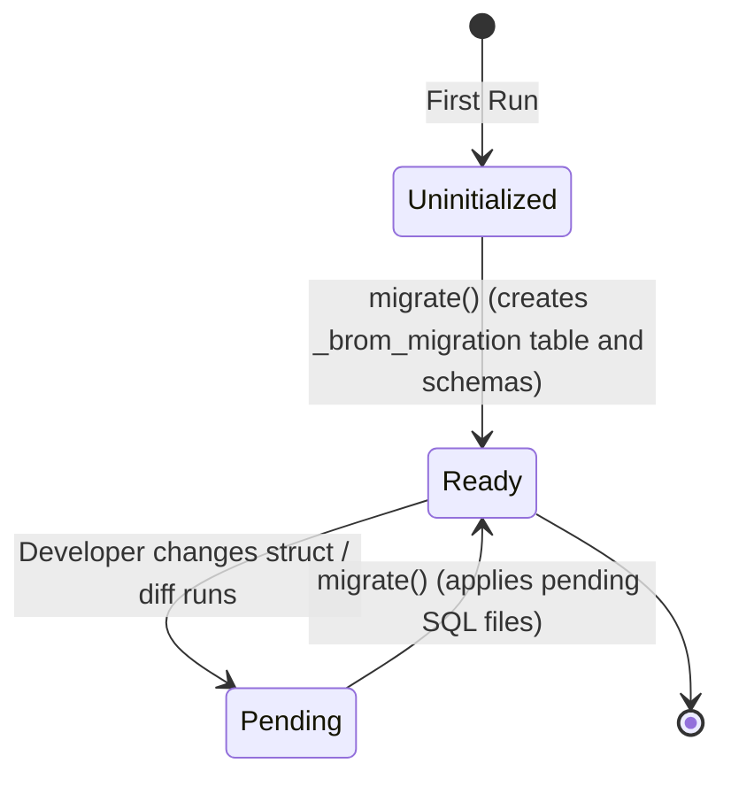

# Behavioral Specification

| Field | Value |
|-------|-------|
| **Project** | brom |
| **Version** | 1.0.0 |
| **Last Updated** | 2026-04-09 |

> Last verified against: cc2263c

## 1. brom-macros

> Procedural macros that synthesize JSON schema definitions, Axum endpoints, and SQLite syntax from Rust structs.

### Public API

| Macro | Signature | Returns | Errors |
|----------|-----------|---------|--------|
| `#[derive(BromEntity)]` | `TokenStream -> TokenStream` | `impl EntitySchema` | Compile-time errors on invalid types |

### Behavioral Scenarios

[HAPPY] Valid Entity Definition
GIVEN a Rust struct with standard types (`String`, `i64`) annotated with `#[derive(BromEntity)]`
WHEN the macro expands
THEN it generates `CREATE TABLE` SQLite syntax
AND it generates `/api/v1/entities` Axum CRUD routers
AND it correctly infers `<input type="text">` or standard UI widgets for the schema endpoint

[HAPPY] Entity Definition with UI Override
GIVEN a struct field annotated with `#[brom(ui(widget = "markdown"))]`
WHEN the macro expands
THEN the schema JSON endpoint reports `widget: "markdown"` for this field
AND the Leptos SPA renders a rich text editor instead of a text input

[ERROR] Hidden Required Field
GIVEN a field that is both `#[brom(ui(hidden))]` and does NOT have a default value
WHEN the macro expands
THEN a compile-time error is emitted indicating a missing default provider

[ERROR] Invalid Default Configuration
GIVEN a field with `#[brom(unique)]` and `#[brom(default = "constant")]`
WHEN the macro expands
THEN a compile-time error is emitted (all rows would get the identical unique value)

### Required Test Coverage
- [ ] Compile-tests for valid struct generation
- [ ] Compile-tests (ui tests) for macro failure modes
- [ ] Validation of generated Axum router logic
- [ ] Validation of serialized schema JSON matching expectations

---

## 2. brom-core

> Domain types and traits mapping entities to the persistence and web layers.

### Public API

| Data Type / Trait | Responsibilities | 
|-------------------|------------------|
| `EntitySchema` | Trait implemented by the macro providing metadata |
| `Link<T>` | active-record style lazy wrapper for 1:N relations |
| `ManyToMany<T>` | active-record style lazy wrapper for M:N relations |

### Behavioral Scenarios

[HAPPY] Reading a Foreign Key Without Loading
GIVEN a `BlogPost` entity containing a `Link<Author>`
WHEN `post.author.id()` is called
THEN the internal `i64` identifier is returned
AND zero database queries are executed

[HAPPY] Lazy Loading a Foreign Key
GIVEN a `BlogPost` entity containing a `Link<Author>`
WHEN `post.author.load(&repo).await` is called
THEN a single `SELECT * FROM authors WHERE id = ?` query executes
AND the associated `Author` is returned

[ERROR] Missing Foreign Key Record
GIVEN a `Link<Author>` pointing to an ID that no longer exists in the DB
WHEN `post.author.load(&repo).await` is called
THEN `DbError::RecordNotFound` is returned

[HAPPY] Many-to-Many Loading
GIVEN a `BlogPost` with `tags: ManyToMany<Tag>`
WHEN `post.tags.load(&repo).await` is called
THEN a `JOIN` is performed against the automatically generated `blog_post_tags` junction table
AND a `Vec<Tag>` is returned without N+1 query execution

---

## 3. brom-db

> SQLite infrastructure, pooling, and automated declarative migration runner.

### Migration State Machine

| From | To | Trigger | Side Effects |
|------|----|---------|--------------|
| Uninitialized | Ready | `migrate()` | Generates base internal tables and initial state |
| Ready | Pending | `diff()` | `.sql` files are generated in `migrations/` directory |
| Pending | Ready | `migrate()` | Applies new `.sql` files, updates `_brom_migration` |

### Behavioral Scenarios

[HAPPY] Database Introspection
GIVEN an active SQLite database with standard user tables and internal `_brom_` tables
WHEN `introspect_schema` is called
THEN it returns `IntrospectedTable` representations for all user tables
AND it systematically excludes `_brom_*` and `sqlite_*` internal tables from the result

---

## 4. brom-cli

> Development toolkit executing migrations, introspection, and schema generation.

### Behavioral Scenarios

[HAPPY] Schema Diffing and SQL Generation
GIVEN an expected declarative schema (from JSON) and an actual physical schema (from introspection)
WHEN `DiffEngine::diff()` is called
THEN it computes the minimal sequence of `MigrationOp` transitions
AND sorts operations topologically (e.g., Creates before Alters, handling foreign-key dependencies)
AND `generate_migration_sql` outputs matching `up` and `down` SQLite statements
AND the exact SQLite syntactic structures are strictly verified via `insta` snapshot tests to prevent regressions

[RESTRICTION] Destructive Rollbacks
GIVEN a computed `DropColumn` or `DropTable` operation
WHEN `generate_migration_sql` produces the `down` SQL
THEN it omits automated table-recreation syntax (due to SQLite `ALTER TABLE DROP COLUMN` limitations)
AND injects a SQL `-- TODO: Manual rollback needed` comment for developer action

---

## 5. brom-auth

> Security primitives for Admin UI and API execution.

### Behavioral Scenarios

[HAPPY] Successful Admin Session Login
GIVEN valid admin credentials
WHEN a POST to `/admin/api/login` is made
THEN an Argon2 hash comparison succeeds
AND an HttpOnly, secure session cookie is returned holding a JWT or Session ID

[ERROR] Missing Authentication Header on Protected Route
GIVEN an endpoint generated by the macro with `#[brom(auth = "api_key")]`
WHEN a request is made without a recognized Bearer Token
THEN a `401 Unauthorized` response is returned

[SECURITY] Token Scope Validation
GIVEN a Bearer Token with `read` permissions
WHEN that token attempts a `POST /api/v1/entities` request (requires `write`)
THEN a `403 Forbidden` response is returned

---

## 6. brom-server

> Axum REST API, server components, standard JSON response formatting, and OpenAPI schema generation.

### Public API

| Component | Responsibility |
|-----------|----------------|
| `router` | Assembles the Axum endpoints, combining schema API routes and admin routes. |
| `middleware` | Implements security headers (`X-Frame-Options`, `Referrer-Policy`, `X-Content-Type-Options`) and CORS. |
| `extractor` | Axum extractors (`RequireAdmin`, `RequireApiKey`) to enforce security boundaries at edge. |
| `response` | Enforces the Data Envelope JSON standard (`DataEnvelope`, `PaginatedResponse`). |
| `openapi` | Synthesizes and serves the OpenAPI/Swagger specification mapping all generated endpoints. |

### Contract Constraints
- **Data Envelope Format**: All successful responses must use `{ "data": ... }` to allow top-level metadata injection without breaking client mapping.
- **Problem Details**: Error responses must map to JSON format containing `error`, `message`, and optionally `fields` corresponding to `RFC 7807` shaped problem details.
- **Defense in Depth**: Every router mutation involving external access must pass through `middleware` to enforce missing HTTP security headers.
- **Observability**: All endpoints must be tracked via structured `TraceLayer` middleware, emitting `http_request` spans that include HTTP method, URI, status, and latency. Sensitive functions must use `#[tracing::instrument(skip_all)]` or explicit field redaction.
